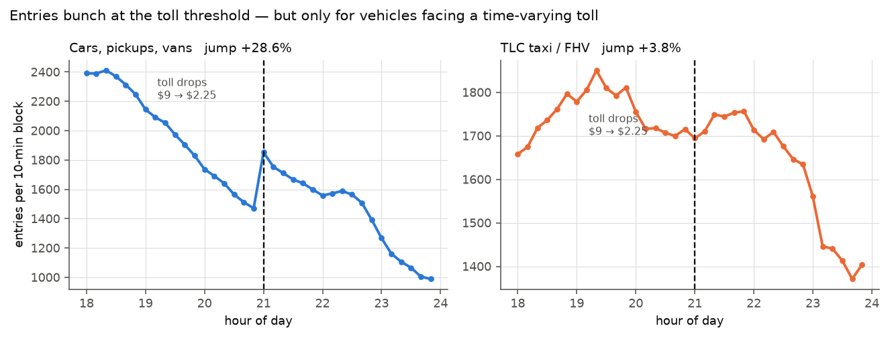
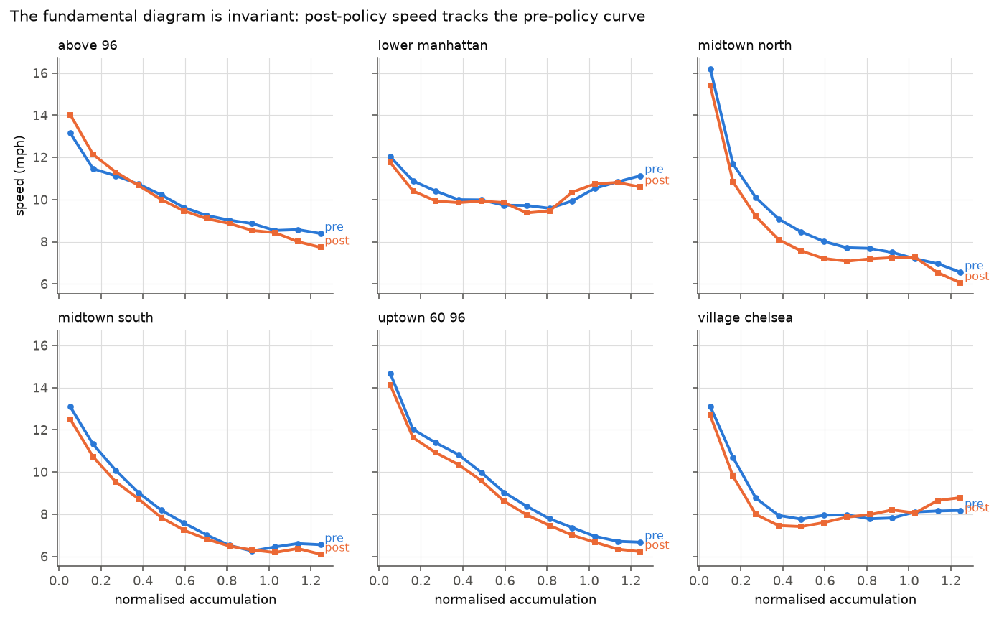
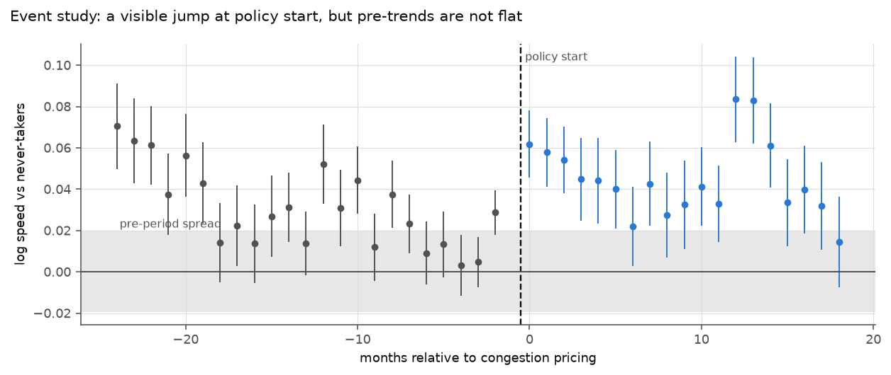
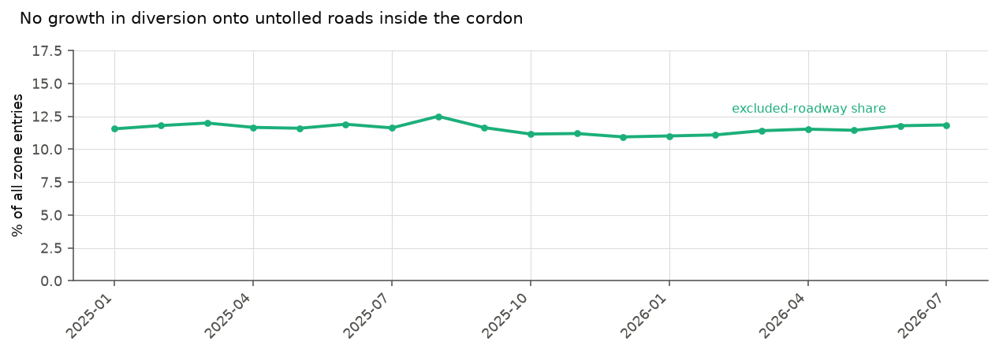

<h1 align="center">manhattan-twin</h1>

<p align="center">
  <strong>A physics-constrained digital twin of the Manhattan congestion zone —<br>
  and a test of whether it survives contact with a real policy shock.</strong>
</p>

<p align="center">
  
  
  
  
  
  
</p>

---

Congestion pricing began in the Manhattan CBD on **5 January 2025** — a $9 peak
toll on a cordon below 60th Street. That is a clean before-and-after on a
network with unusually good open data, so it is a natural test of a claim people
make about traffic digital twins: that the gap between a physics model's
prediction and reality measures *human behaviour*.

This repository builds that twin, runs it across the shock, and checks the claim.
**It does not hold up** — and the way it fails is the interesting part.

## Results at a glance

| | Finding | Verdict |
|---|---|---|
| 🎯 | Cars bunch **+28.6%** at the 21:00 toll step; flat-fee taxis **+3.8%** | **Clean causal result** |
| 📐 | The fundamental diagram is **invariant** across the policy | Physics holds |
| 📉 | Speed effect **+1.5%** — but a pre-policy placebo gives **−1.2%** | Not separable |
| 🛣️ | Untolled-road share flat at **11–12%**, no diversion growth | Two instruments agree |
| ❌ | The twin **loses to its own ablation** at every parameter value | Framing fails |

---

## 1. Drivers respond to the price

The toll drops **$9 → $2.25** at exactly 21:00, every day of the week, and entries
are published in 10-minute blocks. Drivers wait for the cheaper rate — visible as
a dip before the threshold and a spike after.



The right panel is the falsification. **Taxis and FHVs pay a flat per-trip fee
with no time variation**, so they have no reason to retime — and they don't. A
recording artefact at the hour boundary would have moved both panels equally.

| Vehicle class | Jump at 21:00 | Toll faced |
|---|--:|---|
| **Cars, pickups, vans** | **+28.6%** | Time-varying, $9 → $2.25 |
| Single-unit trucks | +12.5% | Time-varying |
| **TLC taxi / FHV** | **+3.8%** | Flat per-trip fee |
| Buses / motorcycles | ~0% | — |

This result needs no model, no control group, and no parallel-trends assumption.
It is the cheapest analysis in the project and the only unambiguous one.

## 2. The physics does not break

The fundamental diagram — speed as a function of how many vehicles are in an
area — is the twin's physics block, assumed policy-invariant. Comparing speed
**at matched accumulation**, pre versus post:



The curves track each other across all six reservoirs. The policy-period shift
(−7.6% to +0.2%) is the same size as the shift between two *pre-policy* periods.
A street at a given density behaves the same way whether or not drivers were
charged to get there — so whatever the toll did, **all of it is demand-side**.

## 3. The speed effect is small and confounded

Two-way fixed effects, 298 in-cordon bus segments against **3,529 outer-borough
never-takers**. Manhattan above 60th St is *not* a valid control — it receives the
diverted traffic — so it is estimated separately.



| Specification | Estimate | t |
|---|--:|--:|
| In-cordon × post | **+1.5%** | 2.46 |
| Above-60th × post (spillover) | +0.7% | 0.85 |
| **Placebo: pretend policy began Jan 2024** | **−1.2%** | −2.09 |

A placebo using pre-period data only produces a "significant" effect of
comparable size and opposite sign. Pre-trends are as large as the effect.

## 4. No diversion onto untolled roads

FDR Drive and the West Side Highway run through the middle of the cordon and are
**exempt from the toll** — the obvious escape route.



The untolled share of entries is flat at 11–12% for nineteen months, and DOT link
speeds on those corridors show no break. Two independent instruments agree:
diversion is not where the response went. The visible margin is *when* people
drive, not which road they take.

## 5. The twin loses to its own ablation

The mandatory ablation — identical architecture, fundamental-diagram closure
replaced by an unconstrained network — across a sweep of the externally pinned
jam-accumulation parameter:

| `k_jam` | 30 | 60 | 90 | 120 | 150 |
|---|--:|--:|--:|--:|--:|
| Physics twin, post-RMSE | 0.263 | 0.273 | 0.279 | 0.280 | 0.283 |
| **Ablation, post-RMSE** | **0.138** | **0.138** | **0.138** | **0.138** | **0.138** |
| Behaviour shift, policy | 1.78 | 2.71 | 3.71 | 3.67 | 4.07 |
| Behaviour shift, *placebo* | 1.75 | 2.98 | 3.67 | 3.76 | 4.04 |

The unconstrained model fits **twice as well at every pin**, and the
frozen-physics behavioural shift tracks its own placebo throughout — the two
series move together as `k_jam` changes, which says the quantity is tracking the
parameter rather than the policy.

**Reported rather than buried.** The residual-as-behaviour framing does not
survive its own placebo tests.

---

## The observable problem, and why it forced a redesign

The obvious data source is the NYC DOT real-time speed feed. It does not work,
for a reason worth stating:

> Manhattan has only **25 links** in that feed, all limited-access — and the
> in-cordon ones sit on FDR Drive and the West Side Highway, which are
> **exempt from the toll**. A twin built on it would mostly model roads the
> policy does not price.

The fix reassigns every source to the job it actually does well:

| Source | Role | Why |
|---|---|---|
| **MTA bus segment speeds** | Primary observable | Link-level, on the tolled avenues; the probe is toll-exempt and runs a fixed route, so no route-selection bias |
| **TLC yellow taxi** | OD structure, circuity | Dwell-free speed; metered distance makes rerouting measurable |
| **DOT link speeds** | Diversion channel | The untolled roads *are* the escape route — measure them as such |
| **CRZ entries** | Treatment intensity | 10-minute resolution enables the bunching design |
| **B&T crossings** | Pre-period volumes | CRZ entries begin at launch; this reaches back to 2019 |
| **Subway + Citi Bike** | Mode shift | Reported as bounds, never point estimates |
| **NOAA Central Park** | Control | Fed *into* the model so it cannot leak into the residual |

## Architecture

```
                 ┌──────────────┐
  7 open-data    │  data/       │  monthly Parquet cache, resumable
  sources    ──▶ │  ETL layer   │  (Socrata / CloudFront / NOAA)
                 └──────┬───────┘
                        │
                 ┌──────▼───────┐
                 │  network/    │  taxi-zone geometry, cordon classification
                 │  panel/      │  OD · segment · reservoir panels
                 └──────┬───────┘
                        │
         ┌──────────────┼──────────────┐
         │              │              │
   ┌─────▼─────┐  ┌─────▼─────┐  ┌─────▼──────┐
   │ analysis/ │  │  models/  │  │  figures/  │
   │ bunching  │  │ reservoir │  │ 4 pub figs │
   │ exposure  │  │ MFD + ODE │  └────────────┘
   │ diversion │  │ twin+abl. │
   └───────────┘  └───────────┘
```

The twin is a **reservoir state-space model**, not a PINN — there is no
within-link spatial coordinate, no observed density, and no link flow count, so
there is no PDE to enforce. What there is: a conservation ODE integrated by a
differentiable rollout, closed by a fundamental diagram that is **monotone by
construction** rather than by penalty.

```python
dn_r/dt = q_in_r(t) + Σ β_{s→r}(t)·O_s(t) − O_r(t)     # conservation, exact
O_r(t)  = P_r(n_r(t)) / L_r                            # trip completions
v_r(t)  = P_r(n_r(t)) / n_r(t)                         # speed
P_r(n)  = n · v_free,r · f_θ(n / n_jam,r)              # f_θ decreasing by construction
```

## Quickstart

```bash
uv sync
make data          # all seven sources, ~4 GB, cached per month
make experiments   # twin + ablation + frozen-physics
make figures       # regenerate the four figures
make test
```

Every pull is cached per month, so re-running is a no-op. Individual sources:

```bash
uv run python -m src.mtwin.data bus     # crz · bt · dot · subway · weather
uv run python -c "from src.mtwin.data import tlc; tlc.pull_yellow()"
```

## Layout

```
src/mtwin/
  data/      ETL, one module per source; Parquet cache keyed by (source, month)
  network/   taxi-zone geometry and cordon classification
  panel/     analysis panels: taxi OD · bus segment · reservoir state
  analysis/  bunching RD · exposure DiD · diversion · decomposition
  models/    reservoir partition · MFD · the twin · experiments
  figures/   publication figures
tests/       regression tests for the estimator bugs below
outputs/     figures and tables
```

## Notes for anyone extending this

Four bugs cost real time here, and each returned a **plausible number while being
wrong** — the failure mode worth guarding against, since a crash announces itself
and a biased coefficient does not. All four are pinned by tests in `tests/`:

- **Weighted fixed effects.** Applying `sqrt(w)` before demeaning by *unweighted*
  means does not absorb the fixed effects; group levels leaked into every
  event-time coefficient as a spurious `+0.6` offset.
- **A circular twin.** The accumulation proxy is `trips / speed`, so feeding it in
  as a covariate and predicting speed puts speed on both sides. Accumulation must
  be *integrated* from demand.
- **Premature convergence.** The alternating-projection demeaner watched only the
  response, exiting before the regressors were absorbed.
- **Silent nulls.** GHCN pads its fields, and `"     8"` casts to null, not 8 —
  every weather reading vanished without an error.

Platform specifics: Python 3.12 (torch wheels do not cover 3.14 yet), MPS used
when available. Socrata will time out on unfiltered aggregates, needs a stable
`$order` for offset paging, and rejects `:id` ordering on grouped queries.

## Full write-up

**[`RESULTS.md`](RESULTS.md)** — method, every number, and the limitations that
constrain them.

## Prior work

Effect-size estimation is not an open contribution: **NBER w33584**, *The
Network-Wide Effects of Congestion Pricing* (Cook, Kreidieh, Vasserman, Allcott,
Arora, Tomkins) measured network-wide speed effects using Google Maps data. The
question here is a model-diagnostic one — *does a network-physics model
calibrated pre-policy still hold post-policy, and if not, which block broke?*

## License

MIT
