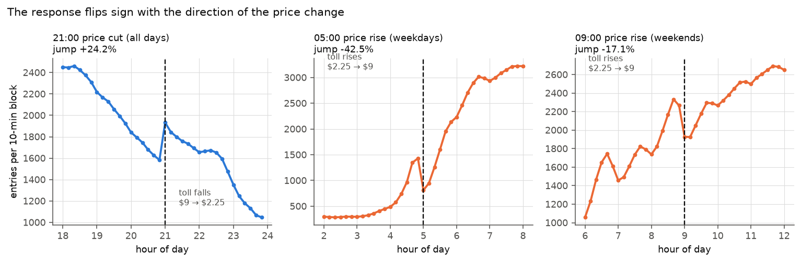

<h1 align="center">manhattan-twin</h1>

<p align="center">
  <strong>What happened to Manhattan traffic when congestion pricing started?<br>
  A traffic model built on 43 months of NYC and MTA open data.</strong>
</p>

<p align="center">
  
  
  
  
  
  
  
  
</p>

---

Congestion pricing began in the Manhattan CBD on **5 January 2025** — a $9 peak
toll on a cordon below 60th Street, and a rare clean before-and-after on a
network with unusually good open data.

**The headline finding: drivers did not drive less. They changed *when* they
drove.** Entries into the zone jump **+24%** the moment the toll drops at 21:00,
and fall **−43%** the moment it rises at 05:00. The response reverses with the
direction of the price change, which is what makes it causal rather than
coincidental.

The second finding is about method. This project was built to test a claim
people make about traffic digital twins — that the gap between a physics model's
prediction and reality measures human behaviour. **It does not hold up**, and it
fails in an unexpected way: the gap never grows at all. The model predicts the
policy period slightly *better* than ordinary periods, because drivers retimed
their trips while the road physics the model describes never changed.

## Results at a glance

| | Finding | Verdict |
|---|---|---|
| 🎯 | Entries move with the price at **all three** toll thresholds — and reverse where the toll *rises* | **Clean causal result** |
| 💵 | Semi-elasticity **−0.12 to −0.31**; response settles to a **~22% plateau** | Transferable, durable |
| ❌ | The model's forecast error across the policy sits **below** its own placebo band | **Premise fails** |
| 📉 | Speed effect **+1.9%** on running speed; synthetic control inconclusive | Not identified |
| 📐 | The traffic fundamental diagram is **invariant** across the policy | Physics holds |
| ✅ | Imposing that physics **beats** leaving it free, 6/6 runs | Constraint earns its place |

**Data:** 43 months (2023–2026) across eight NYC and MTA open-data sources —
bus segment speeds, taxi and for-hire trip records, congestion-zone entry counts
at 10-minute resolution, bridge and tunnel crossings, subway ridership, road
sensor speeds, Citi Bike, and weather.

---

## 1. Drivers respond to the price

The toll drops **$9 → $2.25** at exactly 21:00, every day of the week, and entries
are published in 10-minute blocks. Drivers wait for the cheaper rate — visible as
a dip before the threshold and a spike after.


The right panel is the falsification. **Taxis and FHVs pay a flat per-trip fee
with no time variation**, so they have no reason to retime — and they don't. A
recording artefact at the hour boundary would have moved both panels equally.

The stronger test uses the whole toll schedule. Two of the three thresholds are
price **rises**, where drivers should go early and leave a hole *after* the
step — the opposite pattern:



| Threshold | Price | Jump | Semi-elasticity |
|---|---|--:|--:|
| 21:00, all days | falls $9 → $2.25 | **+24.2%** | −0.174 |
| 05:00, weekdays | rises $2.25 → $9 | **−42.5%** (p=0.000) | −0.307 |
| 09:00, weekends | rises $2.25 → $9 | −17.1% | −0.123 |

All three carry the predicted sign. An artefact at an hour boundary has no
reason to track the *direction* of a price change. Quarterly re-estimation shows
the response easing from 33% to a stable **~22% plateau** — habituation, but not
surrender.

| Vehicle class | Jump at 21:00 | Toll faced |
|---|--:|---|
| **Cars, pickups, vans** | **+28.6%** | Time-varying, $9 → $2.25 |
| Single-unit trucks | +8.8% | Time-varying |
| **TLC taxi / FHV** | **+3.8%** | Flat per-trip fee |
| Buses / motorcycles | ~0% | — |

This result needs no model, no control group, and no parallel-trends assumption.
It is the cheapest analysis in the project and the only unambiguous one.

## 2. The physics does not break

The fundamental diagram — speed as a function of how many vehicles are in an
area — is the twin's physics block, assumed policy-invariant. Comparing speed
**at matched accumulation**, pre versus post:


The curves track each other across all six reservoirs. The policy-period shift
(−7.6% to +0.2%) is the same size as the shift between two *pre-policy* periods.
A street at a given density behaves the same way whether or not drivers were
charged to get there — so whatever the toll did, **all of it is demand-side**.

## 3. The speed effect is small and confounded

Two-way fixed effects, 298 in-cordon bus segments against **3,529 outer-borough
never-takers**. Manhattan above 60th St is *not* a valid control — it receives the
diverted traffic — so it is estimated separately.


| Specification | Estimate | t |
|---|--:|--:|
| In-cordon × post | **+1.5%** | 2.44 |
| Above-60th × post (spillover) | +0.7% | 0.85 |
| **Placebo: pretend policy began Jan 2024** | **−1.2%** | −2.09 |

A placebo using pre-period data only produces a "significant" effect of
comparable size and opposite sign. Pre-trends are as large as the effect.

## 4. No diversion onto untolled roads

FDR Drive and the West Side Highway run through the middle of the cordon and are
**exempt from the toll** — the obvious escape route.


The untolled share of entries is flat at 11–12% for nineteen months, and DOT link
speeds on those corridors show no break. Two independent instruments agree:
diversion is not where the response went. The visible margin is *when* people
drive, not which road they take.

## 5. The physics constraint earns its place — but the residual says nothing

An earlier version of this analysis reported that the twin lost to its own
ablation. **That comparison was unfair and the conclusion was wrong.** It pitted
a conservation rollout driven by seven smooth covariates against an
unconstrained regression with no rollout at all — two architectures, not the
physics constraint.

Holding the architecture fixed and varying only the constraint:

| Arm | Rollout | Closure | post-RMSE | Params |
|---|:--:|---|--:|--:|
| **monotone** | yes | fundamental diagram, decreasing by construction | **0.2816** | 1,939 |
| free | yes | unconstrained function of accumulation | 0.2898 | 2,900 |
| none | no | direct regression from covariates | 0.1364 | 4,470 |

**The fundamental diagram wins 6 of 6 runs** (3 seeds × 2 pins), by five to ten
times the seed noise, with a third fewer parameters. What is expensive is the
*rollout*, not the constraint.

The premise still fails, but elsewhere. A calendar-matched rolling-origin
backtest puts the twin's placebo forecast error at **[0.297, 0.375]** — and its
error across the policy period at **0.263**, *below* the band. The twin predicts
the congestion-pricing period slightly better than ordinary ones.

There is no anomalous gap, so there is nothing for "the gap is behaviour" to
measure. Drivers retimed; the fundamental diagram did not care. **A twin that
models the road rather than the driver stays accurate through exactly the shock
it was built to detect.**

---

## The observable problem, and why it forced a redesign

The obvious data source is the NYC DOT real-time speed feed. It does not work,
for a reason worth stating:

> Manhattan has only **25 links** in that feed, all limited-access — and the
> in-cordon ones sit on FDR Drive and the West Side Highway, which are
> **exempt from the toll**. A twin built on it would mostly model roads the
> policy does not price.

The fix reassigns every source to the job it actually does well:

| Source | Role | Why |
|---|---|---|
| **MTA bus segment speeds** | Primary observable | Link-level, on the tolled avenues; the probe is toll-exempt and runs a fixed route, so no route-selection bias |
| **TLC yellow taxi** | OD structure, circuity | Dwell-free speed; metered distance makes rerouting measurable |
| **DOT link speeds** | Diversion channel | The untolled roads *are* the escape route — measure them as such |
| **CRZ entries** | Treatment intensity | 10-minute resolution enables the bunching design |
| **B&T crossings** | Pre-period volumes | CRZ entries begin at launch; this reaches back to 2019 |
| **Subway + Citi Bike** | Mode shift | Reported as bounds, never point estimates |
| **NOAA Central Park** | Control | Fed *into* the model so it cannot leak into the residual |

## Architecture

```
                 ┌──────────────┐
  7 open-data    │  data/       │  monthly Parquet cache, resumable
  sources    ──▶ │  ETL layer   │  (Socrata / CloudFront / NOAA)
                 └──────┬───────┘
                        │
                 ┌──────▼───────┐
                 │  network/    │  taxi-zone geometry, cordon classification
                 │  panel/      │  OD · segment · reservoir panels
                 └──────┬───────┘
                        │
         ┌──────────────┼──────────────┐
         │              │              │
   ┌─────▼─────┐  ┌─────▼─────┐  ┌─────▼──────┐
   │ analysis/ │  │  models/  │  │  figures/  │
   │ bunching  │  │ reservoir │  │ 4 pub figs │
   │ exposure  │  │ MFD + ODE │  └────────────┘
   │ diversion │  │ twin+abl. │
   └───────────┘  └───────────┘
```

The twin is a **reservoir state-space model**, not a PINN — there is no
within-link spatial coordinate, no observed density, and no link flow count, so
there is no PDE to enforce. What there is: a conservation ODE integrated by a
differentiable rollout, closed by a fundamental diagram that is **monotone by
construction** rather than by penalty.

```python
dn_r/dt = q_in_r(t) + Σ β_{s→r}(t)·O_s(t) − O_r(t)     # conservation, exact
O_r(t)  = P_r(n_r(t)) / L_r                            # trip completions
v_r(t)  = P_r(n_r(t)) / n_r(t)                         # speed
P_r(n)  = n · v_free,r · f_θ(n / n_jam,r)              # f_θ decreasing by construction
```

## Quickstart — reproduces every headline number in ~15 seconds

No downloads required. `data/sample/` holds 6 MB of committed derived tables,
enough to regenerate the results above from a clean clone:

```bash
git clone https://github.com/jaytrivediSF25/manhattan-twin && cd manhattan-twin
uv sync
make quickstart    # headline numbers + all five figures, ~15s, no network
make test
```

Every figure in this README regenerates byte-identically from that path.

<details>
<summary><strong>Running the full pipeline from source data</strong></summary>

```bash
make data          # all eight sources, ~4 GB, several hours, cached per month
make experiments   # twin + ablation + frozen-physics
make figures       # regenerate all five figures
```

Individual sources:

```bash
uv run python -m src.mtwin.data bus   # crz · bt · dot · subway · weather · closures · citibike
uv run python -c "from src.mtwin.data import tlc; tlc.pull_yellow()"
```

Every pull is cached per month, so re-running is a no-op.

**Data source selection.** `MTWIN_USE_SAMPLE=1` forces the committed sample,
`=0` forces `data/raw/`. Unset, it uses `data/raw/` when present and falls back
to the sample only when `data/raw/` is absent entirely — so a half-finished pull
is never silently topped up with committed aggregates.

Two analyses need the full pull and degrade gracefully without it: the
mode-shift term in the decomposition (needs subway and bridge/tunnel data) and
the DOT link-speed diversion check. The excluded-roadway-share instrument that
the diversion result actually cites works from the sample.

</details>

## Layout

```
src/mtwin/
  data/      ETL, one module per source; Parquet cache keyed by (source, month)
  network/   taxi-zone geometry and cordon classification
  panel/     analysis panels: taxi OD · bus segment · reservoir state
  analysis/  bunching RD · exposure DiD · diversion · decomposition
  models/    reservoir partition · MFD · the twin · experiments
  figures/   publication figures
tests/       regression tests for the estimator bugs below
data/sample/ 6 MB of committed derived tables — the zero-download path
outputs/     figures and tables
```

## Notes for anyone extending this

Four bugs cost real time here, and each returned a **plausible number while being
wrong** — the failure mode worth guarding against, since a crash announces itself
and a biased coefficient does not. All four are pinned by tests in `tests/`:

- **Weighted fixed effects.** Applying `sqrt(w)` before demeaning by *unweighted*
  means does not absorb the fixed effects; group levels leaked into every
  event-time coefficient as a spurious `+0.6` offset.
- **A circular twin.** The accumulation proxy is `trips / speed`, so feeding it in
  as a covariate and predicting speed puts speed on both sides. Accumulation must
  be *integrated* from demand.
- **Premature convergence.** The alternating-projection demeaner watched only the
  response, exiting before the regressors were absorbed.
- **Silent nulls.** GHCN pads its fields, and `"     8"` casts to null, not 8 —
  every weather reading vanished without an error.
- **An unfair ablation.** Comparing a constrained rollout against an
  unconstrained *regression* tests the architecture, not the constraint — and
  reversed the headline conclusion until it was fixed.
- **A synthetic control that fit perfectly.** 326 donors against 24 pre-periods
  reproduced the training window exactly (RMSE 0.0000) and predicted nothing.

Platform specifics: Python 3.12 (torch wheels do not cover 3.14 yet), MPS used
when available. Socrata will time out on unfiltered aggregates, needs a stable
`$order` for offset paging, and rejects `:id` ordering on grouped queries.

## What I'd do differently

Four things I got wrong, kept, and would change if I started again. They are
here because the errors were more instructive than the results.

**I compared the wrong two things, and it reversed a conclusion.** My first
ablation set the constrained model against an unconstrained *regression* — two
different architectures — and I reported that the physics lost. It hadn't. Once
I held the architecture fixed and varied only the constraint, the physics won
6/6 runs. The lesson is that an ablation has to isolate one thing, and I didn't
check that mine did until the result looked surprising enough to re-examine.

**I trusted a perfect fit.** The first synthetic control matched the pre-period
exactly, RMSE 0.0000. That should have been alarming immediately — 326 donors
against 24 pre-periods can memorise anything — but a clean number is seductive
and I nearly wrote it up. I'd now treat any suspiciously good in-sample fit as a
bug report rather than a result.

**I picked the observable before checking what it covered.** The obvious data
source was the city's road-sensor speed feed. It has 25 Manhattan links, all
highways, and the ones inside the zone are on roads that are *exempt from the
toll*. An hour of checking coverage before building would have saved the
redesign.

**I under-weighted measurement.** Bus speed blends driving time with time
stopped at the kerb, and dwell doesn't respond to congestion. That single fact
was attenuating the effect by ~40% and making a placebo look significant.
Separating the two did more for identification than any estimator change I made.

If I continued this, the highest-value next step is a cross-city control group.
Every control here is inside New York and shares city-wide shocks with the
treated units, which is the weakness the design most needs to fix — and it isn't
solvable with open data for this period.

## Full write-up

**[`RESULTS.md`](RESULTS.md)** — method, every number, and the limitations that
constrain them.

## Prior work

Effect-size estimation is not an open contribution: **NBER w33584**, *The
Network-Wide Effects of Congestion Pricing* (Cook, Kreidieh, Vasserman, Allcott,
Arora, Tomkins) measured network-wide speed effects using Google Maps data. The
question here is a model-diagnostic one — *does a network-physics model
calibrated pre-policy still hold post-policy, and if not, which block broke?*

## License

MIT
